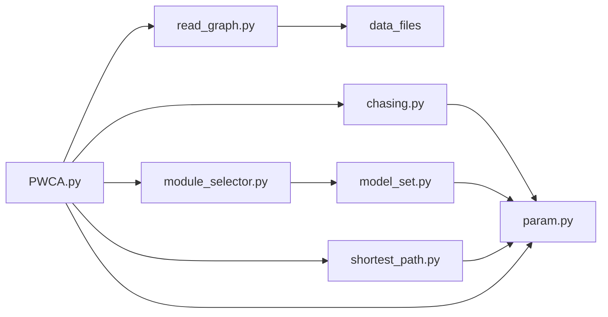

# PWCA

## Structure

## Files

- Sample Data:
  - snodes.txt
  - enodes.txt
  - graph.txt
- Code:
  - PWCA: the main code
  - read_graph.py: define the functions to read data
  - param.py: defne the parameters
  - model_set: define the base models
  - module_selector.py: select the target model
  - shortest_path.py: define the time-decay shortest path algorithm
  - chasing.py: define the chasing function

## To Run

`python PWCA.py`
