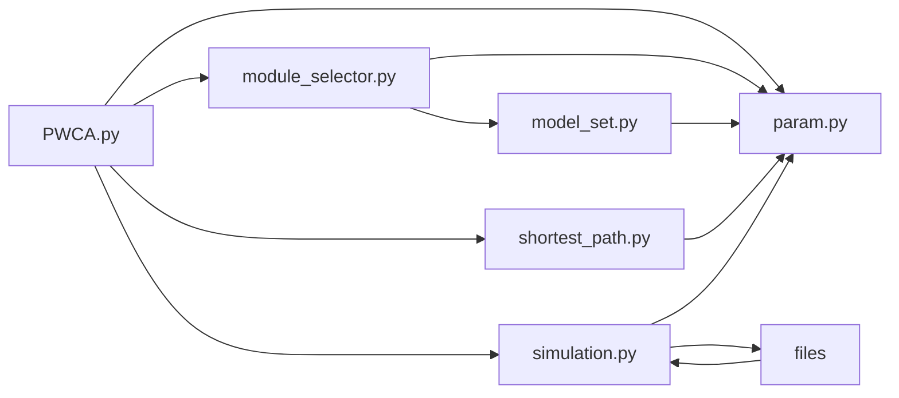

# PWCA

## Structure

## Parameters

1. Need to be modified, default compiler in first line of every python file
2. `-g`: generate new nodes and write them to files
   * For example, `./PWCA.py -g`
   * `./PWCA.py` will read orders from files
3. *Place to change input files:* `param.py`
